# 再也不用担心客户反馈收集了!推荐16款高效自动化的神器

每个月要从邮件、社交媒体、客服系统各种渠道整理客户反馈,数据散落一地,分析起来头疼。手动发调查问卷回复率低,想知道客户到底满不满意只能靠猜,改进方向也不清晰。现在有一批智能化的客户反馈收集平台能帮你自动化整个流程,从多渠道采集到AI分析到实时预警,全程可视化追踪。这些工具有的集成NPS/CSAT/CES全套指标,有的提供热力图和会话录制,还有的用AI自动提取情感和主题。这篇文章整理了16款值得关注的客户反馈调查工具,从中小企业到大型企业都有适合的方案。

---

## **[Zonka Feedback](https://www.zonkafeedback.com)**

AI驱动的客户反馈智能平台,将非结构化数据转化为实时、基于角色的洞察和细粒度见解。

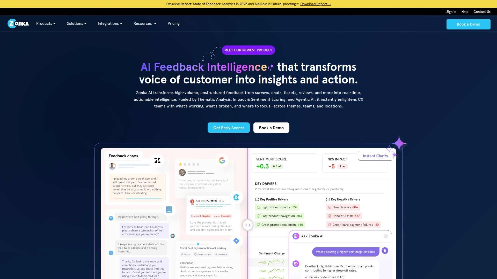

这个平台最大的特点是把AI技术深度整合到反馈管理的每个环节。从调查创建到数据分析再到闭环行动,全程智能化处理,大幅提升效率。

**智能调查创建功能很强大:** 提供30多种问题类型,支持跳转逻辑自动化调查流程。多语言支持能自动翻译和本地化,让全球反馈收集变简单。白标定制功能允许自定义品牌和设计,确保无缝的品牌体验。预填充技术能自动填充数据字段,通过个性化提升完成率。

跨渠道反馈收集覆盖全面,包括网站嵌入式调查、产品内反馈、邮件和短信、WhatsApp互动、离线响应、数字反馈按钮和微调查。这些选项确保在客户与品牌互动的任何地方都能捕获反馈。

**强大的分析引擎是核心优势:** 情感分析能理解响应背后的情绪。主题和实体检测用于趋势识别。基于意图的路由实现更智能的工作流。自动标记和分类让数据组织更轻松。

官方描述称"Zonka Feedback简化CX,让你能通过强大的调查与客户展开有意义的双向对话。几分钟内设计精美调查,从所有接触点收集数据,通过AI分析更好地理解客户,并闭环反馈循环——全部在一个强大平台内完成"。适合需要全面客户体验管理解决方案的各类企业。

---

## **[SurveyMonkey](https://www.surveymonkey.com)**

全球知名的在线调查平台,拖拽式界面配合500多个模板让调查创建变得简单。

SurveyMonkey被G2用户评为"95%的调查功能与Qualtrics相同,但平台直观性高10倍"。提供多渠道分发,可通过邮件、社交媒体、网站嵌入和二维码分享调查。

AI驱动的分析提供情感分析、数据趋势和自动化报告。用户特别喜欢它的"即用即分享仪表板",方便展示给利益相关者。自动化和集成功能连接Slack、HubSpot、Salesforce等100多个工具。

**定价灵活:** 免费计划允许10个问题25个响应。付费计划从每用户每月25美元起。对中小企业来说价格实惠,功能全面。

优点是用户友好、快速设置、模板和问题类型丰富、与业务工具的集成能力强。缺点是免费计划功能和响应数受限,高级报告需要付费。根据G2数据,SurveyMonkey客户看到投资回报的时间比Microsoft Forms快,上线时间比Qualtrics快2倍。

***

## **[Qualtrics](https://www.qualtrics.com)**

企业级体验管理平台,通过AI实时分析提供全方位的客户交互视图。

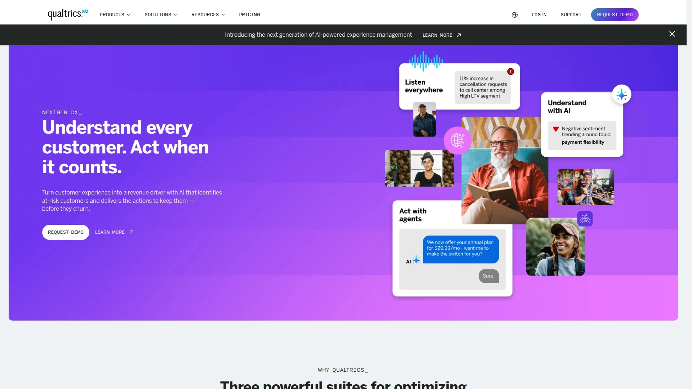

Qualtrics XM提供全渠道客户体验管理,将来自超过128个来源的数据与基于文本分析的洞察融合,深入理解客户情绪、意图、情感等。对痛点和机会领域的洞察无与伦比。

**功能强大但定价昂贵:** 提供预测性AI和文本分析,跨XM仪表板覆盖客户、员工、产品、品牌。全面的集成和客户数据平台连接。定价为企业客户定制,基于模块、使用量和需求。

用户反馈显示"人们常把Qualtrics看作调查工具,但它为组织提供了围绕客户体验构建完整项目的许多可能性"。缺点是"除非真正以正确方式使用所有功能,否则价格不具竞争力,这对某些组织可能是挑战,因为它被设计为多部门工具"。

适合需要深入洞察客户、员工、产品和品牌体验的大型企业。连接全企业范围的反馈,帮助数据驱动团队理解和优化关键互动。在分析深度方面主导市场。

***

## **[Typeform](https://www.typeform.com)**

以对话式交互体验著称的现代调查工具,一次一个问题的流程让调查更像聊天。

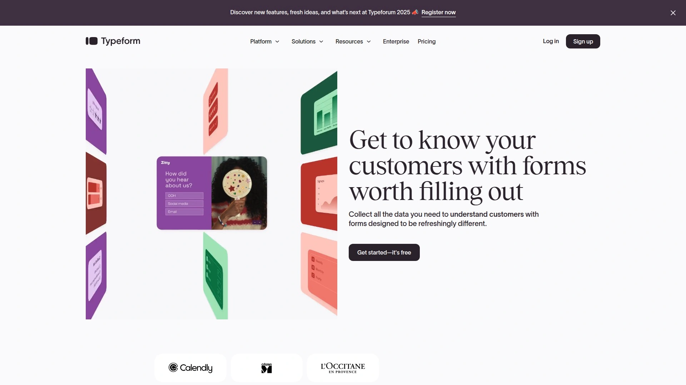

Typeform的最大优势是视觉吸引力和用户参与度。根据Typeform 2025年数据,72%的用户报告参与度更高。提供活力品牌套件、字体和逻辑跳转,创建互动式调查。

**定制化是强项:** 支持多种问题类型包括多选、短文本/长文本、排名、文件上传、支付等。高级设计选项、自定义主题和品牌。连接500多个应用,包括Zapier、Google Sheets、HubSpot和Slack。

GDPR合规,具备高级响应设置和权限。优点是界面高度吸引人且用户友好、高级定制和品牌、强大的条件逻辑实现个性化调查、强大的第三方集成。

缺点是免费计划响应和功能有限,比基本调查工具更贵,没有离线功能。定价从免费计划(10个响应/月)开始,付费计划从每月25美元起。适合需要客户反馈和潜在客户开发工具的企业和营销人员。

***

## **[Zendesk](https://www.zendesk.com)**

客户支持和反馈管理一体化解决方案,将反馈无缝整合到支持工作流程中。

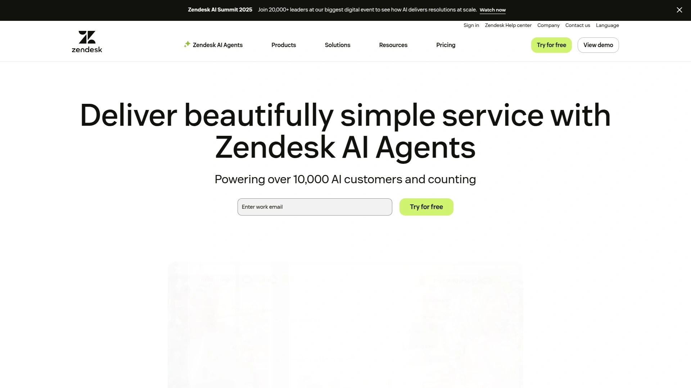

Zendesk通过内置工单逻辑让团队能立即对客户情绪采取行动。提供AI时代的完整客户体验解决方案,提供大规模交付快速个性化体验所需的一切。

**核心功能包括:** 客户反馈和调查功能,允许闭环处理客户问题。详细的分析工具追踪客户满意度。定价从每用户每月19美元起(年付),前三个定价计划自动包含免费试用。

优点是可扩展性强、工单管理出色。缺点是不能通过NPS调查衡量客户忠诚度,Zendesk的完整功能套件可能超出某些企业需求。

Software Advice评分4.4/5,用户喜欢可扩展性和工单管理。G2评分4.3/5,几位用户对学习曲线感到沮丧。适合寻求客户支持和反馈管理一体化解决方案的企业。

***

## **[Medallia](https://www.medallia.com)**

体验管理平台,利用AI和机器学习识别错失机会并优化客户旅程。

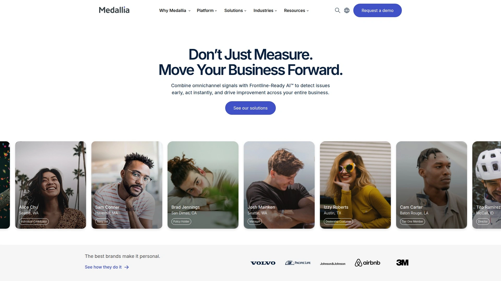

Medallia是强大工具,旨在实时捕获和分析客户体验。帮助企业从客户互动中获得宝贵洞察,使他们能做出数据驱动的决策以提升客户满意度。

**顶级功能包括:** 交易、调查、客流量监控。提供高级分析、实时反馈和全面支持。用户友好界面和强大集成能力让它成为大型组织提升客户体验项目的宝贵资产。

用户评价"我认为Medallia是一个完整的工具,具有许多功能,帮助我们收集客户反馈并理解他们的愿望和需求。它易于使用,有多个仪表板"。

需要改进的地方是"有时这个网站/系统有问题。大多数时候我知道它在维护中,这让跟踪团队的客户反馈和投诉变得困难"。定价需联系供应商。适合需要实施强大客户反馈系统的大型组织。

***

## **[Hotjar](https://www.hotjar.com)**

实时网站反馈和用户行为分析工具,通过热力图、录制和调查提供全面洞察。

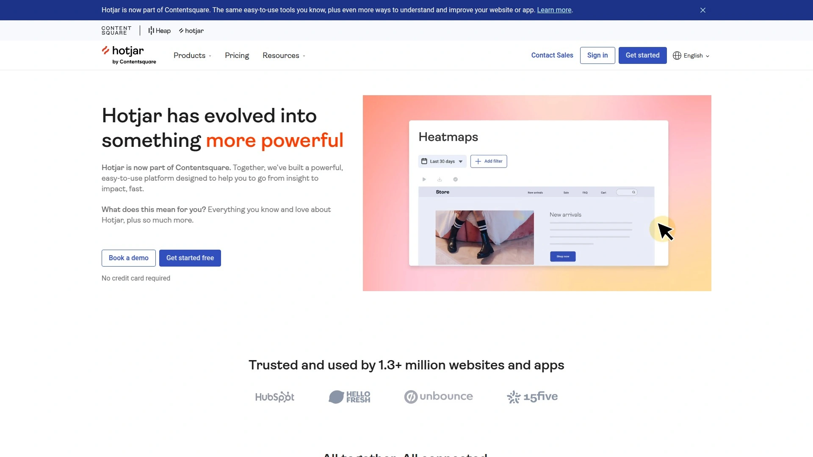

Hotjar是强大的网站反馈工具,提供多样化功能用于理解用户行为和优化网站。通过热力图、录制和调查,提供用户互动的全面洞察,使企业能识别改进领域并有效提升用户体验。

**关键功能:** 热力图可视化用户在网站上的互动。反馈投票通过可定制投票直接从网站访问者收集反馈。会话录制观看用户会话录制以了解用户如何导航你的网站。与WordPress和Shopify等各种平台集成,便于实施。

定价从每月39美元起,根据网站流量和所需功能而变化。也为小型网站提供功能有限的免费基础计划。

优点是全面分析,通过热力图和会话录制等工具提供用户行为的详细洞察。缺点是免费计划在功能和使用上有限制。G2评分4.6/5(700多条评价),Gartner评分4.4/5(80多个评分)。

---

## **[Survicate](https://www.survicate.com)**

多渠道调查分发平台,实时数据收集和可视化功能强大。

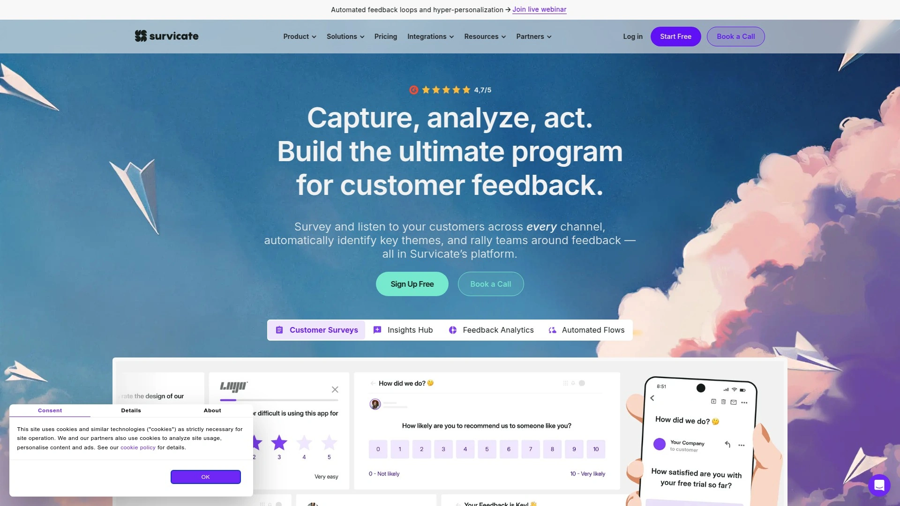

Survicate是强大但简单易用的调查工具,用于跨邮件、网络、产品内等各种渠道收集持续反馈。提供多渠道调查分发,包括邮件和移动应用。

实时数据收集和可视化。预构建的调查模板快速部署。优点是中小企业和大型企业的全面调查功能,易于跨各种渠道实施,提供详细洞察和分析。

缺点是基础计划对调查量有限制,新用户学习曲线陡峭。提供免费试用。适合需要跨多个渠道收集客户反馈的企业。

***

## **[SurveySparrow](https://surveysparrow.com)**

对话式调查软件,让在应用内和网站上收集持续客户反馈变得简单。

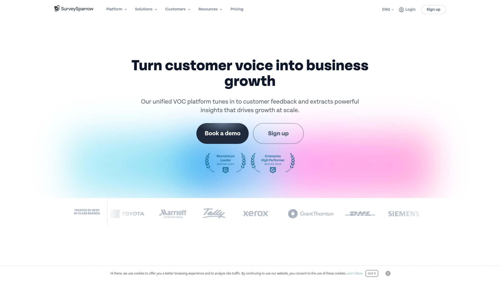

SurveySparrow是调查软件,让企业轻松通过快速的应用内和网站调查收集持续客户反馈。免费AI工具之一,将AI引入免费计划。

提供对话式调查界面,提高参与度。多渠道分发支持网站、邮件、移动应用。实时分析和报告。

适合希望以对话方式收集反馈的企业。界面友好,设置快速。

---

## **[Sogolytics](https://www.sogolytics.com)**

客户体验平台,通过强大的调查和反馈工具推动客户留存。

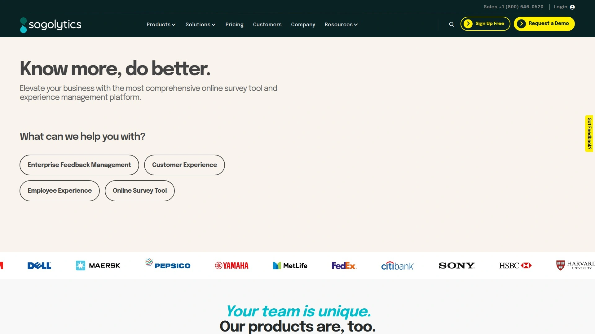

SogoCX提供全面的客户体验管理解决方案。企业级客户反馈软件,设计用于大规模捕获和分析客户洞察。

提供高级调查功能和详细分析。多渠道反馈收集。实时洞察和报告。

适合需要可扩展解决方案的大中型企业。提供强大的数据分析能力。

---

## **[Userpilot](https://userpilot.com)**

产品内用户反馈平台,提供丰富的调查模板库和高级触发定位功能。

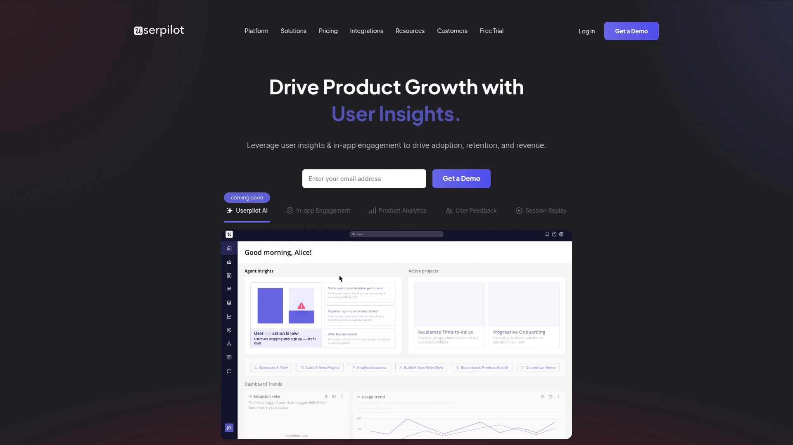

Userpilot突出功能包括调查模板库、高级调查触发(包括基于事件)和定位、调查本地化。专注于产品内反馈收集,帮助SaaS和数字产品团队理解用户需求。

提供事件驱动的调查触发,在关键时刻捕获反馈。调查本地化支持全球用户。详细的用户细分和定位。

适合SaaS公司和产品团队,需要深入理解产品内用户行为和反馈。

---

## **[UserTesting](https://www.usertesting.com)**

用户体验研究平台,通过真实用户测试收集定性反馈。

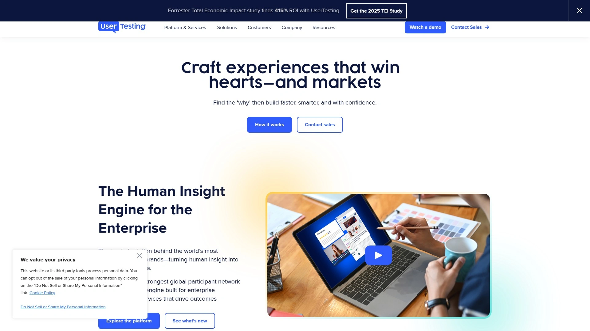

UserTesting与Medallia等平台相比,更专注于用户测试和定性研究。提供真实用户的视频反馈,深入了解用户如何与产品互动。

快速招募测试参与者。详细的视频录制和洞察。可用性测试和原型验证。

适合产品经理、UX设计师和研究人员,需要定性用户反馈来改进产品设计和体验。

***

## **[Feedier](https://www.feedier.com)**

游戏化调查平台,通过互动格式提升响应率。

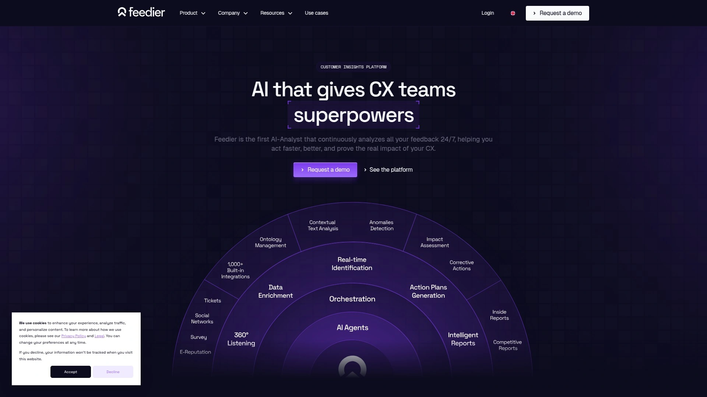

Feedier的特色是游戏化调查,增强参与度。高级分析和报告工具。支持多语言调查和反馈渠道。

优点是高度吸引人的格式提升响应率,可根据不同行业定制,通过情感分析提供可操作洞察。缺点是基础用户支持有限,小企业定价偏高。

提供免费试用。适合希望通过创新方式提高调查响应率的企业。

---

## **[Qualaroo](https://qualaroo.com)**

网站和应用内微调查工具,通过即时反馈改善用户体验。

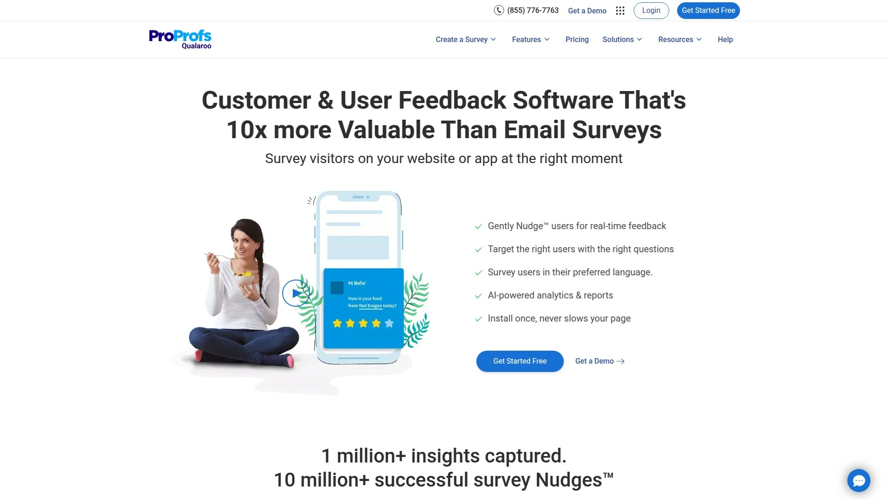

Qualaroo是SurveyMonkey的替代品之一,专注于轻量级即时反馈收集。在用户浏览网站或使用应用时弹出简短问题。

目标定位和触发选项丰富。快速部署,不影响页面加载速度。实时洞察仪表板。

适合电商和SaaS公司,需要在关键时刻捕获用户反馈以优化转化率。

***

## **[GetFeedback](https://www.getfeedback.com)**

Salesforce生态系统内的客户反馈解决方案,CRM集成无缝。

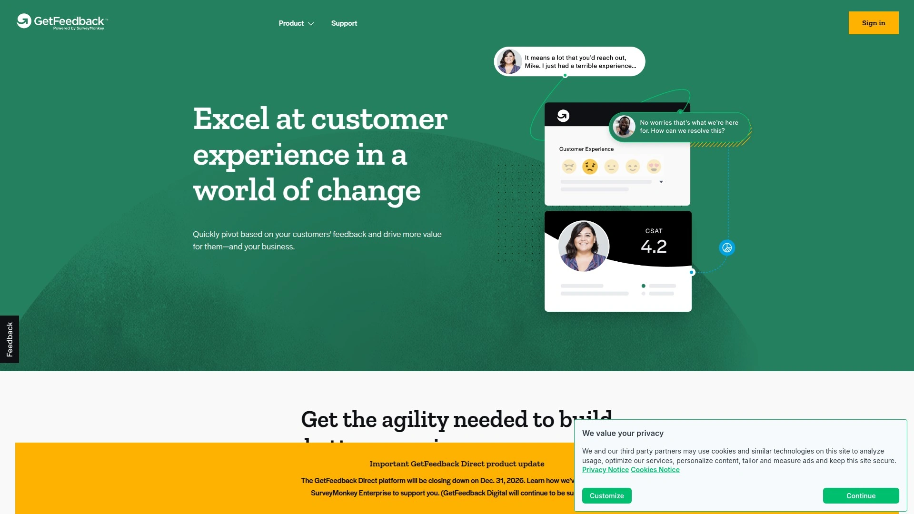

GetFeedback是SurveyMonkey替代品,特别适合Salesforce用户。深度集成到Salesforce工作流,反馈数据自动同步到CRM。

移动优化的调查设计。实时警报和工作流自动化。客户旅程映射。

适合已使用Salesforce的企业,希望将反馈数据与客户关系管理紧密结合。

***

## **[ClearlyRated](https://www.clearlyrated.com)**

基于NPS的客户满意度调查平台,专注B2B行业。

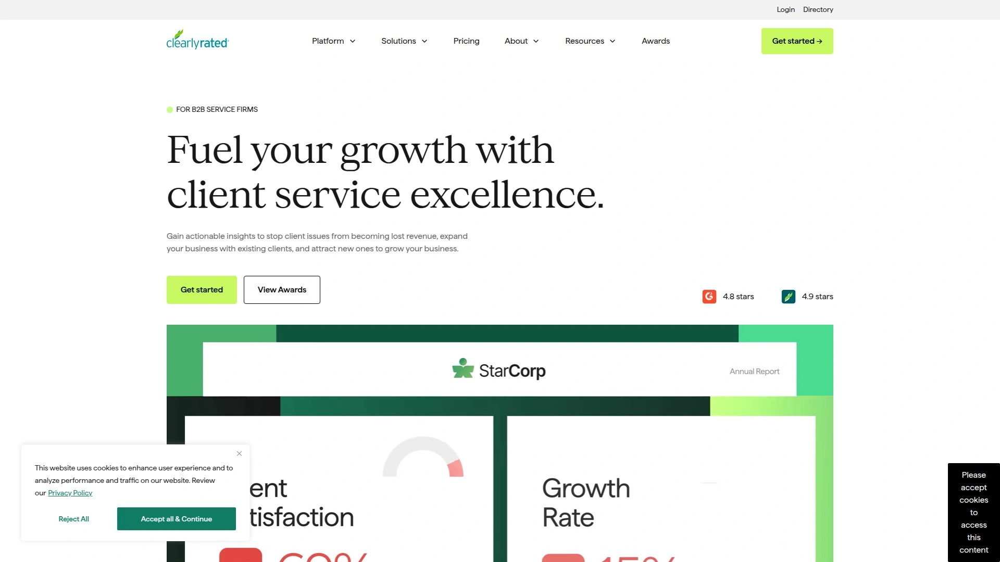

ClearlyRated是SurveyMonkey的最佳替代品之一,特别为B2B服务公司设计。自动化NPS调查和客户满意度跟踪。

提供行业基准对比。客户证言和评价收集。详细的报告和洞察。

适合咨询、IT服务、人力资源等B2B服务行业,需要持续监控客户满意度并与行业标准对比。

***

## 常见问题

**客户反馈软件的核心功能有哪些?**

现代客户反馈软件的核心功能包括多渠道反馈收集(网站、邮件、短信、社交媒体、应用内等)、AI驱动的情感分析和主题识别、实时数据可视化仪表板、自动化工作流和警报系统、以及闭环反馈管理。像Zonka Feedback这样的平台提供30多种问题类型和跳转逻辑,能自动适应受访者的回答。高级平台如Qualtrics还提供预测分析,识别客户流失风险和机会。关键是要选择支持你实际使用的渠道并能与现有工具(CRM、帮助台系统)集成的平台。

**中小企业应该选择免费还是付费的调查工具?**

取决于调查规模和功能需求。SurveyMonkey和Typeform都提供免费计划,但限制在10个问题和10-25个响应。对于偶尔做简单市场调研的小企业,免费计划够用。但如果需要品牌定制、高级逻辑、深度分析或更多响应,付费计划是必需的。SurveySparrow、SoGoSurvey等平台在免费计划中包含AI功能,性价比不错。建议先从免费版本开始测试,看看响应量和功能是否满足需求,再决定是否升级。对于成长型企业,每月25-100美元的投入通常能获得显著更好的功能和支持。

**如何提高客户调查的响应率?**

响应率取决于调查设计、时机和渠道选择。首先,保持调查简短——理想情况下5-7个问题,完成时间不超过3分钟。使用对话式界面如Typeform能提升参与度,72%的用户报告更高响应率。游戏化设计如Feedier也能显著提升参与。时机很关键,在客户完成购买或互动后立即发送调查效果最好。个性化也很重要,使用预填充技术如Zonka Feedback提供的,能让客户感觉被重视。多渠道触达增加曝光,邮件、短信、应用内弹窗结合使用比单一渠道有效。最后,提供激励(折扣码、抽奖)能显著提升响应,但要确保合规。

---

## 总结

选对客户反馈收集工具能让你从被动应对投诉转变为主动优化体验,从数据混乱到洞察清晰,整个客户体验管理效率翻倍。不同平台各有特色,从企业级的Qualtrics到亲民的SurveyMonkey,从对话式的Typeform到行为分析的Hotjar,总有一款适合你的场景和预算。如果你需要一个将AI智能、多渠道收集、深度分析和自动化闭环全部打通的一体化解决方案,[Zonka Feedback](https://www.zonkafeedback.com)通过30多种问题类型、智能逻辑跳转、情感分析和主题识别,特别适合追求高效自动化、想要在几分钟内就能从反馈数据中提取可操作洞察的现代化企业,无论是中小企业还是大型组织都能找到合适的功能配置。
